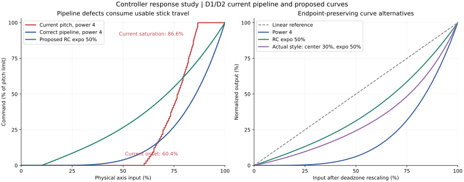

# Controller analog response study

## Scope

Initial study completed 2026-10-02 against repository commit `71739b5bd6bf69e8ba51678084e5142ed387b568`. Scope is physical controllers configured in the Android controller editor, with both D1 and D2 traced. No gameplay implementation changed

The user's desired behavior is correct: fine control near center, full authority at full throw, and no substantial plateau before the endpoint. The standalone power formula already meets those mathematical requirements. The surrounding pipeline does not: it applies the deadzone after the power, quantizes the signal severely, and supplies pitch with twice its allowed command range at default sensitivity. Replacing the power formula alone will not fix this

## Work plan

- [x] Trace controller configuration, Kotlin shaping, JNI/SDL delivery, engine sensitivity, deadzone, and clamping in D1 and D2
- [x] Compare endpoint-preserving RC expo and Betaflight rate models against the actual implementation
- [x] Reproduce representative response curves numerically and identify what is proven versus device-dependent
- [x] Document a recommended input pipeline, settings, graph, implementation scope, and regression checks

## Current signal path

Paths below are relative to the repository root; line numbers describe the inspected revision

| Stage            | Implementation                                                 | Consequence                                                                                 |
| ---------------- | -------------------------------------------------------------- | ------------------------------------------------------------------------------------------- |
| Setting          | `ControllerConfigModel.kt:197,219,237`; `TouchBindings.kt:446` | Per physical axis, power 1 through 4, default 1                                             |
| Curve            | `TouchControl.kt:127`; `MainActivity.kt:3993,4251`             | `sign(x) * abs(x)^p`, applied directly to MotionEvent input, before deadzone                |
| Digital branches | `MainActivity.kt:4177,4265`                                    | Meta-action thresholds and trigger processing also consume shaped values                    |
| Mixing           | `InputMixer.kt:68`                                             | Sources add and clamp to [-1,1]; touch provenance is a single boolean                       |
| JNI              | `android_input.c:1651,1699`                                    | Float multiplied by 32767, truncated to integer                                             |
| SDL event        | `d1/arch/sdl/joy.c:183`; `d2/arch/sdl/joy.c:180`               | Divide by 256, leaving at most 127 positive magnitude steps for the Kotlin path             |
| Deadzone         | `d1/main/kconfig.c:1517`; `d2/main/kconfig.c:1558`             | Apply function-specific `JoystickDead` to already curved, quantized input; bypass for touch |
| Command          | `d1/main/kconfig.c:1641`; `d2/main/kconfig.c:1680`             | Multiply by FrameTime, sensitivity/8, and undercalibrate+1                                  |
| Limits           | `d1/main/kconfig.c:1938`; `d2/main/kconfig.c:1978`             | Pitch capped at FrameTime/2; yaw and bank at FrameTime                                      |

Kotlin filenames are under `android/app/src/main/java/com/dxxredux/app/`; Android C/C++ filenames are under `android/app/src/main/cpp/`

The curve is a power function, despite its "Exponential response" label. For `0 < x < 1`, increasing `p` decreases output. Its endpoints are exactly -1, 0, and 1 before transport. There is no reciprocal exponent or reversed mapping here. Existing `ControllerAxisExponentTest.kt` confirms the isolated 0.5 -> 0.25 example but never exercises the full native pipeline

### Deadzone and power are in the wrong order

Ignoring quantization, define `D_d(t) = max(0, (t-d)/(1-d))` for positive input. Current behavior is `D_d(x^p)`. Desired behavior is `(D_d(x))^p`, or another normalized curve applied to `D_d(x)`

The current physical deadzone boundary is `x = d^(1/p)`. A nominal 10% deadzone would become 56.2% at power 4 even with exact percentages

There is additional rounding. `android_gamepad_config.cpp:90-99,182-188,224` maps the editor's 10% to raw 12, then to a `JoystickDead` value of 2, then the engine multiplies by 8. The actual deadzone is 16/128 = 12.5% for pitch, yaw, bank, and slides. Throttle uses a different scale of 3 and consequently different rounding. The power-4 continuous deadzone boundary becomes 59.46%; integer quantization delays the first nonzero sample further

### Pitch has a built-in early plateau

Both games default `JoystickSens` to 8 and `JoystickUndercalibrate` to 0 in `playsave.c`. The controller command before clamping is consequently `FrameTime * shaped_axis`. Pitch then clamps at `FrameTime/2`

As a fraction of the pitch command ceiling, the continuous approximation is:

```text
pitch(x) = min(1, 2 * D_d(x^p))
yaw(x)   = min(1,     D_d(x^p))
```

For general effective gain `G` relative to the command ceiling, saturation starts at `[d + (1-d)/G]^(1/p)` when `G > 1`. Here `G = sensitivity * (undercalibrate+1) / (8*L)`, with `L=0.5` for pitch and `L=1` for yaw/bank. Sensitivity above neutral or nonzero undercalibration can cause early saturation on other axes too. The Android config loader stages the current PlayerCfg and does not neutralize those legacy settings

Increasing the power actually moves this plateau closer to full throw. It does not create it. But the enlarged deadzone and steep remaining transition make the overall result feel especially abrupt at high powers. This is a plausible explanation of the reported feel, not an on-device reproduction of the user's exact configuration

### Resolution also loses endpoint accuracy

JNI maps both Kotlin endpoints to +/-32767, and truncating division by 256 gives +/-127. The deadzone and FrameTime conversions truncate again. At nominal 10% deadzone and default gain, yaw's modeled endpoint is about 98.35% at FrameTime 1092. Pitch hides that shortfall by clipping early

With no deadzone, power 4 also needs roughly 30% raw throw merely to reach the first 1/128 native axis step. A curve intended to improve fine control should not be collapsed to this resolution before the engine consumes it

### Other interactions to address

- The editor permits zero analog deadzone, but the native config loader at `android_gamepad_config.cpp:212` accepts thresholds only from 5 through 95. That can reject the complete native controller config
- Analog deadzones and digital activation thresholds share one config map. Digital thresholds should describe physical travel and should not move when analog expo changes
- The editor's live bar displays physical samples; it does not display the final shaped gameplay command. A raw-input bar can still reach 100% while the effective command clips or falls short
- Active touch input bypasses the native deadzone for the combined axis. Because InputMixer merges sources first, an added touch contribution changes processing of the controller contribution too
- Half-axis combiners need deadzone/curve processing on each source before combination; the native loader currently applies analog deadzones only to physical axes 0-5, 11, and 12
- `TouchControl.kt` also contains an S-curve, but the physical-controller wrapper explicitly chooses the power curve. The S-curve cannot explain this path. Its upper-half flattening would also be undesirable as the replacement for the requested feel

## Numerical reproduction

The following is a source-based numerical model, not a hardware measurement or compiled engine execution. Assumptions: isolated controller, 10% editor deadzone, default sensitivity 8, undercalibration 0, no mouse/touch/gyro, ordinary flight, FrameTime 1092 (approximately 60 Hz). Float transport and C-style integer truncation are modeled; Kotlin power is approximated by a double power rounded to Float. Threshold scan resolution is 0.01 percentage points

| Power | First nonzero pitch command | First full pitch command |
| ----- | --------------------------- | ------------------------ |
| 1     | 13.29% throw                | 56.26% throw             |
| 2     | 36.45% throw                | 75.01% throw             |
| 3     | 51.03% throw                | 82.55% throw             |
| 4     | 60.37% throw                | 86.61% throw             |

Power 4 therefore uses only about 26 percentage points of physical throw to traverse its entire output range in this configuration



The left graph includes the existing transport steps. Proposed curves use continuous arithmetic, the actual requested 10% physical deadzone, and correct scaling to the pitch ceiling. The right graph isolates curve shape after deadzone removal. Parameters are illustrative, not flight-tested defaults

Scratch reproduction files are in `temp/controller-response-study/`: `analyze.py`, `results.json`, and PNG/SVG plots. The script checked 142 cubic/Actual-style parameter combinations at 10,001 samples each for endpoints, monotonicity, odd symmetry, boundedness, and absence of premature mathematical saturation. These checks do not validate a future implementation

## What RC software does

### Transmitter expo

Spektrum's aircraft transmitter manual explicitly separates expo from overall travel: positive expo softens the center while preserving travel. It also displays a response graph. This matches the requested behavior. [Spektrum DX6 manual, D/R and Exponential](https://www.spektrumrc.com/ProdInfo/Files/SPM6700-Manual_EN.pdf)

EdgeTX distinguishes input weight/rates from expo and supports graphically edited custom curves. Its ordinary positive-expo implementation corresponds, apart from fixed-point rounding, to a blend of linear and cubic terms. Its optional extended-expo build path differs at stronger settings; a numeric expo percentage is not a universal cross-product standard. [EdgeTX input settings](https://manual.edgetx.org/v2.11/bw-radios/model-select/inputs-mixes-and-outputs/inputs), [EdgeTX mixer source](https://github.com/EdgeTX/edgetx/blob/main/radio/src/mixer.cpp#L116-L174), [EdgeTX custom curves](https://manual.edgetx.org/v2.8/edgetx-user-manual/user-manual-for-color-screen-radios/model-settings/curves)

### Betaflight models

Betaflight's Actual model exposes independent center sensitivity and maximum rate; expo moves the transition between them. Its documentation defines center sensitivity as the slope near center, not a nonzero rate at centered stick. [Betaflight 4.2 tuning notes](https://betaflight.com/docs/wiki/tuning/4-2-Tuning-Notes#new-rates-modes)

Source-derived formulas below use signed normalized input `u`, expo `e`, center slope `C`, maximum `M`, and legacy super-rate `s`:

```text
Actual: C*u + (M-C)*[(1-e)*u*abs(u) + e*u*abs(u)^5], for M >= C
Legacy Betaflight: 200*R*[(1-e)*u + e*u*abs(u)^3] / (1-s*abs(u))
KISS expo component: (1-e)*u + e*u^3
```

Legacy Betaflight includes parameter remapping and denominator limits; copying only its expo is not copying its complete rate model. Quick Rates uses another rational construction and limits. Actual is the clearest advanced model for our needs. [Betaflight rate implementation, functions applyBetaflightRates through applyQuickRates](https://github.com/betaflight/betaflight/blob/master/src/main/fc/rc.c#L175-L241)

The Betaflight UI supplies rate curves and live previews. Its explicit distinction between scaling throttle across full travel and clipping it is also relevant to avoiding wasted stick movement. [Betaflight PID Tuning Tab](https://betaflight.com/docs/wiki/app/pid-tuning-tab#rateprofile-settings)

These primary sources were inspected on 2026-10-02. The linked development branches can change. The transferable design is endpoint normalization and separation of shape, center response, and output limit. Descent applies rotational thrust commands rather than Betaflight's closed-loop angular-rate setpoints, so our UI should use command percentages, not promise degrees per second

## Recommended formulas and controls

First fix the pipeline even if the existing power curve is retained. No normalized expo formula can compensate for a later unknown gain and clipping stage

Use calibrated signed input `x` in [-1,1], physical deadzone `d` in [0,1), and:

```text
u = sign(x) * max(0, (abs(x)-d)/(1-d))
```

This makes the deadzone independent of the curve and maps the end of the remaining travel back to 1

### Basic RC expo

Recommended first UI: Deadzone and Expo, with larger Expo explicitly labeled as more precision near center

```text
F(u,e) = (1-e)*u + e*u^3       0 <= e <= 1
```

This is an endpoint-preserving family: `F(0)=0`, `F(1)=1`, `F(-1)=-1`, center slope `1-e`, and derivative `(1-e)+3*e*u^2 >= 0`. For positive interior input, output is below the linear reference and strictly below 1. At 50% expo, 25% input produces 13.28%, 50% produces 31.25%, and full input still produces 100%

The advantage over pure `u^p` is that intermediate expo retains nonzero near-center slope. Every pure power above 1 has zero slope exactly at center; powers near 4 can feel excessively soft even after the pipeline is corrected. Keep linear as the baseline default initially; 30-50% expo are useful comparison presets to evaluate, not claims of a universal RC preference

### Optional advanced center control

If two shape controls prove useful, use the normalized Actual-style family:

```text
F(u,c,e) = c*u + (1-c)*[(1-e)*u*abs(u) + e*u*abs(u)^5]
0 <= c <= 1, 0 <= e <= 1
```

Here `c` is center slope relative to full command scale; `e` controls transition shape. The endpoints stay fixed and the derivative is nonnegative. The raw-stick slope just outside a deadzone also includes the factor `1/(1-d)`, which the graph should reflect

A true normalized exponential, `sign(u)*expm1(k*abs(u))/expm1(k)` with its linear limit at `k=0`, also meets the requirements. It is unnecessary unless we specifically want that feel. Custom point curves and numerous Betaflight legacy modes would add complexity before we have evidence they help

An optional maximum-command setting must be a scale `m` in [0,1]: `output=m*F(u)`. Its selected maximum is attained at full input. Leave `m=1` for the user's requested full authority. Do not multiply by a gain above 1 and then clip, or normalize an already clipped curve by its endpoint; a plateau cannot be repaired that way

## Implementation design

1. Create a small pure controller response function shared by runtime input processing and the Compose graph. Keep physical deadzone and analog shape together. Keep raw samples available separately for button thresholds, navigation, diagnostics, and the live input dot. Do not accidentally change touch/mouse acceleration through the existing shared `applyResponseCurve` helper
2. Apply source deadzone and curve before combining controller, touch, and gyro. Define physical axis output independently from the eventual pitch/yaw/slide binding. Apply trigger deadzone in its unipolar range and process half-axis sources before subtraction
3. Preserve enough precision into native command construction. Keep the existing mailbox transport at least 16-bit; remove the Android analog path's intermediate /256 reduction rather than merely rounding it differently. Quantize once at the required engine fixed-point boundary. Use symmetric endpoint normalization for the values actually supplied by JNI
4. Map normalized output to the destination's real command budget when the binding and slide/bank modifiers are known. Pitch uses `FrameTime/2`; yaw/bank use `FrameTime`; thrust requires the existing speed-mode rules to be reviewed. Do not halve an entire physical stick axis in Kotlin: that axis can be rebound or act as a slide axis while a modifier is held
5. Give processed controller contributions an explicit native contract that bypasses legacy controller deadzone, sensitivity, and undercalibration. Keep final aggregate game limits for simultaneous input sources. Do not disguise controllers as touch to exploit the current bypass
6. Resolve mixed-source provenance before coding the native hook. The current summed axis plus `touchActive` bit cannot distinguish a normalized controller contribution from a legacy touch contribution. Either preserve those contributions through the existing mixer/mailbox or deliberately normalize all Android analog producers in the same change. Prefer preserving separate controller contribution semantics for a narrowly scoped controller fix; verify modifier mapping and shared-axis addition. Merely adding a processed boolean to the already summed value is insufficient when source semantics differ
7. Place shared native conversion logic under `android/` and make minimal, equivalent guarded hooks in both games. Preserve desktop behavior. Engine-owned command budgets should be exposed through JNI or native sampling for preview, not duplicated as unexplained Kotlin constants
8. Separate analog deadzone from digital threshold in config if needed, allow zero deadzone consistently, and update model/store/human-readable serialization together. Android formats are pre-release: replace obsolete settings directly under repository policy, without migration machinery. If preserving the power model for the first fix, retain the existing axis_exponents schema and label it accurately

The native provenance/precision work is the largest part of a complete fix. A Kotlin-only polynomial substitution is a small edit but does not meet the requested end-to-end guarantee

## Graph design

Add a reusable Compose Canvas preview to both the stick-axis dialog and single-axis/trigger dialog. Use the same shaping function as gameplay, with any native command conversion sampled from the engine contract

- X: physical axis input, -100% to +100%; Y: command as a percentage of that action's allowed maximum
- Dashed linear reference, visible deadzone band, one clearly labeled effective curve, and a live dot with numeric input/output
- For paired axes, show clearly distinguished X and Y curves or separate previews when their bindings/settings differ; do not imply pitch and yaw have identical physical speeds
- Offer a normalized shape view for comparison, but make the effective input-to-command curve the default. Label a standalone launcher preview as predicted if live pilot/engine state is unavailable
- Show a clipping plateau only when it really exists. In diagnostics, report where full command is first reached. Keep simultaneous-source saturation distinct from the isolated-controller curve
- Use 0-100% axes for triggers. For button mode, show the physical activation boundary instead of an analog response curve
- Support controller focus/navigation and readable narrow dialogs. Changing any curve parameter updates the plot immediately

Keep axis-by-axis shaping initially. A circular stick gate reaches only about 0.707 on each axis at a 45-degree full-radius deflection; that does not mean each axis should output 1. Radial shaping preserves direction but introduces coupled-axis semantics. Treat it as a separate design decision and include diagonal checks rather than silently adding circle-to-square amplification

## Validation for implementation

Extend the existing controller exponent/mixer tests and add one high-level response-sweep regression for D1 and D2. Exercise the physical MotionEvent entry path; injecting only native joystick values skips the Kotlin defect. Use generation-synchronized `axis_probe` introspection instead of screenshots or subjective turn timing

Check default and maximum shape settings, both signs, values just below/above deadzone, intermediate travel, near-endpoint input, and exact endpoints. Verify the actual command budget per binding, rebind pitch to another stick, slide/bank modifiers, triggers, half-axis combinations, mixed touch/gyro input, and press/release thresholds. Repeat at representative frame times to expose quantization or stale FrameTime behavior

The mathematical curve must be strictly below full output before full throw. Digital implementations necessarily have finite bins: require no material early plateau and specify a tolerance of the final representable input/output step. Do not demand impossible infinitely fine response from fixed-point commands

Also check malformed/nonfinite parameters, zero-deadzone config loading, live save/reload, and preview/runtime agreement. Run relevant Android CMake builds for both engines, Kotlin tests and device automation serially, the Windows host build for guarded engine edits, and one scoped code-quality invocation

No game build or device test was run for this study because production code was unchanged. Remaining empirical work is to capture the user's controller/pilot configuration and confirm the precise onset and plateau on hardware. Existing `[joy-jni]`, `[joy-sdl]`, `[joy-dz]` logging and `axis_probe` provide much of the necessary evidence; add only the missing pre/post-shape values and effective settings
